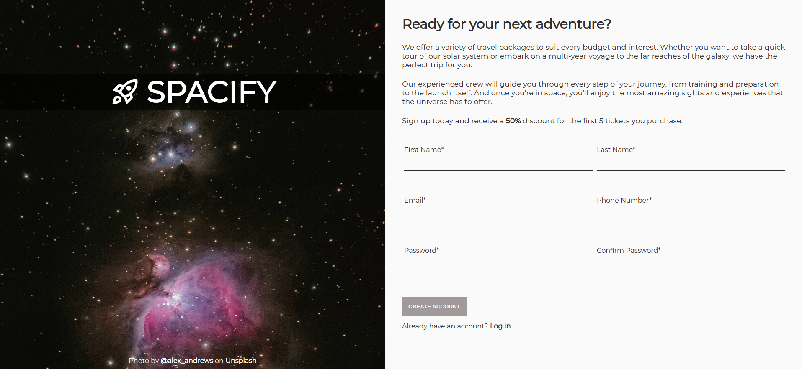

# Sign Up Form



This website implements a basic Sign Up Form for a fake company and it is the submission for [The Odin Project: Sign-up Form](https://www.theodinproject.com/lessons/node-path-intermediate-html-and-css-sign-up-form). The key features are:

- Modern Layout & Input Elements
- Cross-Platform Compatibility


## Live Demo

[Sign Up Form](https://jesusgraterol.github.io/sign-up-form-top/)


## Getting Started

### Requirements

- GIT
- Python ^v3

### Installation

1) Clone the repository
```bash
git clone git@github.com:jesusgraterol/sign-up-form-top.git
```


## Usage

1) Run a local server with:

```bash
python3 -m http.server
```

2) Access the app through: [http://localhost:8000/](http://localhost:8000/)


## Build Process

N/A


## Deployment

Deploys to **Github Pages** automatically when commits are pushed into the `main` branch.


## Built With

- HTML5
- CSS3
- JavaScript


## Running the Tests

```bash
# Unit Tests
N/A

# Integration Tests
N/A

# E2E Tests
N/A
```


## @TODO

N/A


## License

[MIT](https://choosealicense.com/licenses/mit/)


## Acknowledgments

- [Google Fonts](https://fonts.google.com/icons)
- [Unsplash: @alex_andrews](https://unsplash.com/@alex_andrews)